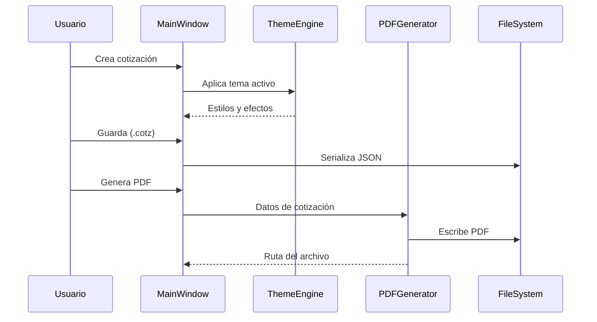
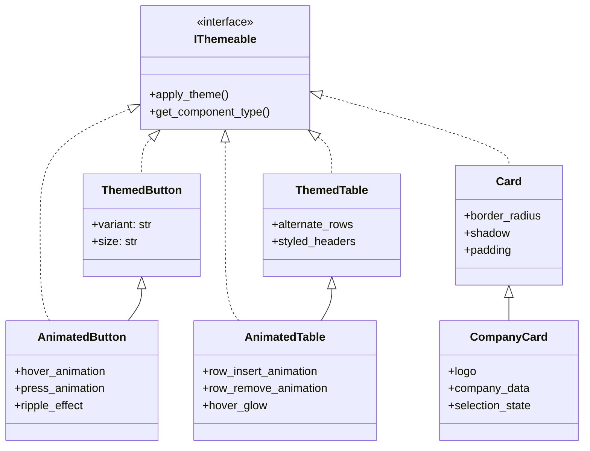
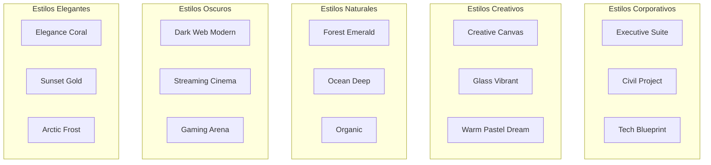
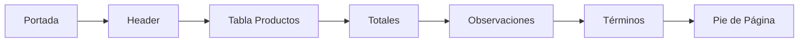

# 🎯 Cotizador Pro

<div align="center">


**Sistema Profesional de Cotizaciones con Soporte Avanzado de Temas**

*Genera cotizaciones profesionales en PDF con interfaz moderna, sistema de temas personalizables y efectos visuales avanzados.*

</div>

---

## 📋 Tabla de Contenidos

- [Características](#-características)
- [Instalación](#-instalación)
- [Inicio Rápido](#-inicio-rápido)
- [Estructura del Proyecto](#-estructura-del-proyecto)
- [Arquitectura](#-arquitectura)
- [Sistema de Temas](#-sistema-de-temas)
- [Componentes UI](#-componentes-ui)
- [Iconos](#-iconos)
- [Plantillas de Portada](#-plantillas-de-portada)
- [Generador de PDF](#-generador-de-pdf)
- [Configuración](#-configuración)
- [Contribución](#-contribución)

---

## ✨ Características

### Funcionalidades Principales
- 📝 **Creación de cotizaciones** con productos, precios y cálculos automáticos
- 🏢 **Gestión de empresas** con logos, datos de contacto y personalización
- 📄 **Generación de PDF** profesional con múltiples estilos
- 📊 **Vista previa en tiempo real** usando PyMuPDF
- 📁 **Historial de cotizaciones** con búsqueda y filtros
- 💾 **Formato `.cotz`** para guardar y compartir cotizaciones

### Sistema de Temas Avanzado
- 🎨 **Temas oficiales**: Oscuro y Claro con diseño moderno
- 🌈 **Temas personalizados**: Soporte completo para temas de terceros
- ✨ **Efectos visuales**: Glassmorphism, blur, bloom, glow y más
- 🎬 **Animaciones**: Hover, ripple, scale y transiciones fluidas
- 🔊 **Sonidos del sistema**: Feedback auditivo configurable
- 🖼️ **Iconos personalizables**: Override de iconos por tema

---

## 🚀 Instalación

### Requisitos Previos
- Python 3.10 o superior
- pip (gestor de paquetes de Python)

### Instalación Automática (Windows)

```bash
# Ejecutar el instalador
install.bat
```

### Instalación Manual

```bash
# Clonar el repositorio
git clone https://github.com/tu-usuario/cotizador-pro.git
cd cotizador-pro

# Crear entorno virtual (recomendado)
python -m venv venv
venv\Scripts\activate  # Windows
source venv/bin/activate  # Linux/Mac

# Instalar dependencias
pip install -r requirements.txt
```

### Dependencias

| Paquete | Versión | Descripción |
|---------|---------|-------------|
| PyQt6 | ≥6.4.0 | Framework GUI Qt6 para Python |
| reportlab | ≥4.0.0 | Generación de documentos PDF |
| PyMuPDF | - | Renderizado PDF a imagen para vistas previas |
| bs4 | - | Parsing HTML para procesamiento de texto |
| requests | - | Cliente HTTP para búsqueda de imágenes |

---

## ⚡ Inicio Rápido

```bash
# Ejecutar con script
run.bat

# O directamente con Python
python main.py
```

---

## 📁 Estructura del Proyecto

```
📦 Cotizacion/
├── 📄 main.py                    # Punto de entrada principal
├── 📄 requirements.txt           # Dependencias del proyecto
├── 📄 setup.py                   # Configuración del paquete
├── 📄 install.bat               # Script de instalación Windows
├── 📄 run.bat                   # Script de ejecución Windows
├── 📄 medidas.json              # Configuración de unidades de medida
│
├── 📂 src/                       # Código fuente principal
│   ├── 📄 __init__.py
│   │
│   ├── 📂 views/                 # Interfaces de usuario (GUI)
│   │   ├── 📄 main_window.py           # Ventana principal (1907 líneas)
│   │   ├── 📄 company_view.py          # Gestión de empresas
│   │   ├── 📄 config_view.py           # Panel de configuración
│   │   ├── 📄 products_window.py       # Editor de productos
│   │   ├── 📄 terms_window.py          # Términos y condiciones
│   │   ├── 📄 observations_window.py   # Observaciones con vista previa
│   │   ├── 📄 cover_page_dialog.py     # Selector de portadas
│   │   ├── 📄 history_window.py        # Historial de cotizaciones
│   │   │
│   │   ├── 📂 styles/            # Sistema de temas y estilos
│   │   │   ├── 📄 theme_engine.py       # Motor central de temas (832 líneas)
│   │   │   ├── 📄 theme_manager.py      # Gestión de temas
│   │   │   ├── 📄 theme_base.py         # Clases base para temas
│   │   │   ├── 📄 themeable.py          # Interface IThemeable
│   │   │   ├── 📄 themeable_mixin.py    # Mixin para componentes
│   │   │   ├── 📄 animation_engine.py   # Motor de animaciones
│   │   │   ├── 📄 effects_engine.py     # Motor de efectos visuales
│   │   │   ├── 📄 layout_engine.py      # Motor de layouts
│   │   │   ├── 📄 sound_manager.py      # Gestor de sonidos
│   │   │   ├── 📄 icon_manager.py       # Gestor de iconos
│   │   │   └── 📄 animations.py         # Animaciones predefinidas
│   │   │
│   │   └── 📂 components/        # Componentes UI reutilizables
│   │       ├── 📂 buttons/              # Botones animados y temáticos
│   │       ├── 📂 cards/                # Tarjetas y cards
│   │       ├── 📂 tables/               # Tablas animadas
│   │       ├── 📂 dialogs/              # Diálogos modales
│   │       ├── 📂 inputs/               # Campos de entrada
│   │       ├── 📂 panels/               # Paneles contenedores
│   │       ├── 📂 widgets/              # Widgets varios
│   │       ├── 📂 notification/         # Sistema de notificaciones
│   │       ├── 📂 editor/               # Editores de texto
│   │       ├── 📂 canvas/               # Canvas para dibujo
│   │       └── 📂 block/                # Bloques de contenido
│   │
│   ├── 📂 logic/                 # Lógica de negocio
│   │   ├── 📂 config/                  # Gestión de configuración
│   │   ├── 📂 company/                 # Lógica de empresas
│   │   ├── 📂 quotation/               # Lógica de cotizaciones
│   │   ├── 📂 history/                 # Gestión del historial
│   │   ├── 📂 file/                    # Manejo de archivos .cotz
│   │   ├── 📂 json/                    # Conversión de unidades
│   │   └── 📂 utils/                   # Utilidades generales
│   │
│   ├── 📂 export/                # Exportación y generación
│   │   ├── 📄 pdf_generator.py         # Generador de PDF (3586 líneas)
│   │   └── 📄 cover_styles.py          # Estilos de portadas
│   │
│   └── 📂 media/                 # Recursos empaquetados
│       └── ...
│
└── 📂 media/                     # Recursos del usuario
    ├── 📂 themes/                # Archivos de temas
    │   ├── 📄 oscuro.json              # Tema oscuro oficial
    │   ├── 📄 claro.json               # Tema claro oficial
    │   ├── 📄 liquid_glass.json        # Tema con efecto vidrio
    │   ├── 📄 midnight_blue.json       # Tema azul noche
    │   ├── 📄 purple_night.json        # Tema púrpura nocturno
    │   └── 📂 custom/                  # Temas personalizados
    │       └── 📂 neon_cyberpunk/      # Ejemplo tema custom
    │
    ├── 📂 icons/                 # Iconos del sistema (48 iconos)
    ├── 📂 covers/                # Plantillas de portada (16 estilos)
    ├── 📂 companies/             # Datos de empresas
    ├── 📂 config/                # Configuración persistente
    ├── 📂 data/                  # Datos de la aplicación
    ├── 📂 images/                # Imágenes cacheadas
    └── 📂 temp/                  # Archivos temporales
```

---

## 🏗️ Arquitectura

### Diagrama de Componentes

```mermaid
graph TB
    subgraph "Capa de Presentación"
        MW[MainWindow]
        CV[CompanyView]
        PW[ProductsWindow]
        TW[TermsWindow]
        OW[ObservationsWindow]
        HW[HistoryWindow]
    end
    
    subgraph "Sistema de Temas"
        TE[ThemeEngine]
        TM[ThemeManager]
        AE[AnimationEngine]
        EE[EffectsEngine]
        SM[SoundManager]
        IM[IconManager]
        LE[LayoutEngine]
    end
    
    subgraph "Componentes UI"
        AB[AnimatedButton]
        AT[AnimatedTable]
        CC[CompanyCard]
        TD[ThemedDialog]
    end
    
    subgraph "Lógica de Negocio"
        CM[ConfigManager]
        CL[CompanyLogic]
        HM[HistoryManager]
        FM[CotzManager]
    end
    
    subgraph "Exportación"
        PG[PDFGenerator]
        CS[CoverStyles]
    end
    
    MW --> CV
    MW --> PW
    MW --> TW
    MW --> OW
    MW --> HW
    
    TE --> TM
    TE --> AE
    TE --> EE
    TE --> SM
    TE --> IM
    TE --> LE
    
    MW --> TE
    CV --> CC
    PW --> AT
    
    MW --> PG
    PG --> CS
    
    MW --> CM
    CV --> CL
    MW --> HM
    MW --> FM
```



### Flujo de Datos



---

## 🎨 Sistema de Temas

El sistema de temas de Cotizador Pro es uno de los más avanzados disponibles para aplicaciones PyQt6, soportando efectos visuales modernos, animaciones fluidas y personalización completa.

### Tipos de Temas

| Tipo | Ubicación | Descripción |
|------|-----------|-------------|
| **Oficiales** | `media/themes/*.json` | Temas creados por el equipo, optimizados |
| **Personalizados** | `media/themes/custom/*/` | Carpetas con tema + recursos opcionales |

### Estructura de un Tema (v2.0)

```json
{
    "name": "Nombre del Tema",
    "version": "2.0",
    "author": "Autor",
    "description": "Descripción del tema",
    "is_official": true,
    
    "colors": { ... },
    "effects": { ... },
    "typography": { ... },
    "animations": { ... },
    "sounds": { ... },
    "layout": { ... },
    "components": { ... },
    "icons": { ... }
}
```

### 🎨 Sección Colors

Define todos los colores del tema organizados por categoría:

```json
"colors": {
    "background": {
        "primary": "#1C1C1E",      // Fondo principal
        "secondary": "#2C2C2E",    // Fondo secundario
        "tertiary": "rgba(255, 255, 255, 0.05)"  // Fondo terciario
    },
    "accent": {
        "primary": "#0A84FF",      // Color de acento principal
        "secondary": "#5AC8FA",    // Acento secundario
        "tertiary": "#34C759",     // Acento terciario
        "glow": "rgba(10, 132, 255, 0.4)"  // Color de brillo
    },
    "text": {
        "primary": "#FFFFFF",      // Texto principal
        "secondary": "#8E8E93",    // Texto secundario
        "muted": "rgba(255, 255, 255, 0.5)",  // Texto atenuado
        "link": "#0A84FF",         // Color de enlaces
        "highlight": "#5AC8FA"    // Texto resaltado
    },
    "borders": {
        "default": "#3A3A3C",      // Borde por defecto
        "focus": "#0A84FF",        // Borde en focus
        "subtle": "rgba(255, 255, 255, 0.1)",  // Borde sutil
        "glow": "#0A84FF"          // Borde con brillo
    },
    "shadows": {
        "small": "0 2px 8px rgba(0, 0, 0, 0.3)",    // Sombra pequeña
        "medium": "0 4px 16px rgba(0, 0, 0, 0.4)",  // Sombra mediana
        "glow": "0 0 20px rgba(10, 132, 255, 0.3)"  // Sombra con brillo
    },
    "states": {
        "success": "#34C759",      // Estado éxito
        "error": "#FF3B30",        // Estado error
        "warning": "#FF9500",      // Estado advertencia
        "info": "#5AC8FA"          // Estado información
    }
}
```

### ✨ Sección Effects

Configura efectos visuales avanzados:

```json
"effects": {
    "transparency": 0,                // Nivel de transparencia global (0-1)
    "glassmorphism": true,           // Efecto de vidrio esmerilado
    "blur": {
        "enabled": false,            // Habilitar blur de fondo
        "radius": 12                 // Radio del blur en píxeles
    },
    "bloom": {
        "enabled": false,            // Habilitar efecto bloom
        "intensity": 0.3,            // Intensidad del bloom (0-1)
        "color": "#0A84FF"           // Color del bloom
    },
    "glow": {
        "enabled": true,             // Habilitar glow en elementos
        "color": "#0A84FF",          // Color del glow
        "intensity": 0.3             // Intensidad (0-1)
    },
    // Efectos adicionales para temas custom
    "neonBorders": true,             // Bordes neón
    "scanlines": false,              // Efecto líneas de escaneo
    "particles": false               // Partículas animadas
}
```

### 📝 Sección Typography

Define la tipografía del tema:

```json
"typography": {
    "fontFamily": "Segoe UI, Arial, sans-serif",  // Fuentes (fallback)
    "fontSize": {
        "xs": "11px",                // Extra pequeño
        "sm": "13px",                // Pequeño
        "base": "14px",              // Base
        "lg": "16px",                // Grande
        "xl": "20px",                // Extra grande
        "xxl": "28px"                // Título
    },
    "fontWeight": {
        "normal": 400,               // Normal
        "medium": 500,               // Medio
        "semibold": 600,             // Semi-negrita
        "bold": 700                  // Negrita
    },
    "letterSpacing": "normal"        // Espaciado entre letras
}
```

### 🎬 Sección Animations

Configura todas las animaciones del sistema:

```json
"animations": {
    "globalSpeed": 1.0,              // Multiplicador de velocidad global
    "components": {
        "button": {
            "hover": {
                "scale": 1.03,        // Escala en hover
                "duration": 150,      // Duración en ms
                "glow": false,        // Glow en hover
                "glowColor": "#FF00FF",    // Color del glow
                "glowIntensity": 0.6       // Intensidad
            },
            "press": {
                "scale": 0.97,        // Escala al presionar
                "duration": 100
            },
            "ripple": {
                "enabled": true,      // Efecto ripple
                "duration": 400,
                "color": "#00FFFF"    // Color del ripple
            }
        },
        "panel": {
            "show": {
                "type": "fade",       // Tipo: fade, slide, slide_fade, scale_fade
                "direction": "up",    // Dirección (para slide)
                "duration": 250,
                "easing": "OutBack"   // Curva de animación
            },
            "hide": {
                "type": "fade",
                "duration": 150
            },
            "glow_pulse": {           // Pulso de glow continuo
                "enabled": true,
                "duration": 2000,
                "from": 0.3,
                "to": 0.6
            }
        },
        "table": {
            "row_insert": {
                "duration": 200,
                "type": "slide_fade"
            },
            "row_remove": {
                "duration": 150
            },
            "row_hover": {
                "glow": true,
                "glowColor": "#00FFFF"
            }
        },
        "window": {
            "show": {
                "type": "scale_fade",
                "from_scale": 0.85,
                "to_scale": 1.0,
                "duration": 350,
                "easing": "OutBack"
            },
            "hide": {
                "type": "fade",
                "duration": 200
            }
        },
        "input": {
            "focus": {
                "duration": 150,
                "glowColor": "#00FFFF",
                "glowIntensity": 0.5
            }
        }
    }
}
```

### 🔊 Sección Sounds

Configuración del sistema de sonidos:

```json
"sounds": {
    "enabled": true,              // Habilitar sonidos
    "useSystemSounds": true,      // Usar sonidos del sistema
    "volume": 0.5                 // Volumen (0-1)
}
```

### 📐 Sección Layout

Define el diseño y espaciado de la interfaz:

```json
"layout": {
    "usePanelsInsteadOfMenus": false,  // Usar paneles en lugar de menús
    "sidebarPosition": "left",          // Posición del sidebar
    "headerStyle": "modern",            // Estilo del header
    "footerVisible": true,              // Mostrar footer
    "windowBorderless": false,          // Ventanas sin borde
    "cornerRadius": {
        "small": 4,                     // Radio pequeño (px)
        "medium": 8,
        "large": 12,
        "xl": 20
    },
    "spacing": {
        "xs": 4,                        // Espaciado extra pequeño
        "sm": 8,
        "base": 16,
        "lg": 24,
        "xl": 32
    },
    "contentMargins": {
        "top": 16,
        "right": 16,
        "bottom": 16,
        "left": 16
    }
}
```

### 🧩 Sección Components

Estilos específicos por tipo de componente:

```json
"components": {
    "button": {
        "padding": "10px 20px",
        "borderRadius": "8px",
        "borderWidth": 1,
        "borderStyle": "solid",
        "backgroundGradient": {         // Gradiente de fondo
            "enabled": true,
            "from": "#1A1A2E",
            "to": "#0D0D1A"
        },
        "hoverBackgroundGradient": {    // Gradiente en hover
            "enabled": true,
            "from": "#FF00FF",
            "to": "#CC00CC"
        }
    },
    "input": {
        "padding": "8px 12px",
        "borderRadius": "6px",
        "minHeight": 36,
        "borderWidth": 2
    },
    "panel": {
        "padding": 16,
        "borderRadius": 12,
        "borderWidth": 1,
        "backgroundOpacity": 0.9
    },
    "table": {
        "rowHeight": 60,
        "headerHeight": 50,
        "alternateRowColors": true,
        "alternateRowOpacity": 0.05
    },
    "dialog": {
        "borderRadius": 12,
        "padding": 20,
        "backdropBlur": true
    },
    "menuBar": {
        "height": 40,
        "itemPadding": "8px 16px"
    },
    "scrollbar": {
        "width": 12,
        "borderRadius": 6,
        "trackColor": "#1A1A2E",
        "thumbColor": "#FF00FF"
    }
}
```

### 🖼️ Sección Icons

Mapeo de iconos personalizados (para temas custom):

```json
"icons": {
    "save": "icons/custom_save.png",
    "delete": "icons/custom_delete.png",
    "add": "icons/custom_add.png"
}
```

### Creando un Tema Personalizado

```
media/themes/custom/
└── mi_tema/
    ├── mi_tema.json        # Archivo de configuración (requerido)
    └── icons/              # Iconos personalizados (opcional)
        ├── save.png
        ├── delete.png
        └── ...
```

### Temas Disponibles

#### Temas Oficiales
| Tema | Descripción |
|------|-------------|
| **Oscuro** | Tema oscuro con acentos azules modernos |
| **Claro** | Tema claro con diseño limpio y profesional |

#### Temas Incluidos
| Tema | Descripción |
|------|-------------|
| **Liquid Glass** | Estilo Aero/Vista con transparencia y glow |
| **Midnight Blue** | Azul noche elegante |
| **Purple Night** | Púrpura nocturno |

#### Plantillas de Cover
| Nombre | Estilo |
|--------|--------|
| Arctic Frost | Minimalista helado |
| Civil Project | Proyectos de ingeniería |
| Code JSON | Estilo código/programador |
| Creative Canvas | Artístico y creativo |
| Dark Web Modern | Moderno oscuro |
| Elegance Coral | Elegante coral |
| Executive Suite | Ejecutivo profesional |
| Forest Emerald | Verde esmeralda |
| Gaming Arena | Gaming/eSports |
| Glass Vibrant | Vidrio vibrante |
| Ocean Deep | Océano profundo |
| Organic | Orgánico natural |
| Streaming Cinema | Cine/streaming |
| Sunset Gold | Dorado atardecer |
| Tech Blueprint | Blueprint técnico |
| Warm Pastel Dream | Pasteles cálidos |

---

## 🧱 Componentes UI

### Jerarquía de Componentes



### Botones

| Componente | Archivo | Características |
|------------|---------|-----------------|
| `AnimatedButton` | `buttons/animated_button.py` | Hover scale, press effect, ripple |
| `ThemedButton` | `buttons/themed_button.py` | Variantes, tamaños, estados |

### Tablas

| Componente | Archivo | Características |
|------------|---------|-----------------|
| `AnimatedTable` | `tables/animated_table.py` | Insert/remove animations |
| `ThemedTable` | `tables/themed_table.py` | Filas alternadas, headers styled |
| `ProductImageTable` | `tables/product_image_table.py` | Imágenes de productos |

### Tarjetas

| Componente | Archivo | Características |
|------------|---------|-----------------|
| `Card` | `cards/card.py` | Contenedor base con estilo |
| `CompanyCard` | `cards/company_card.py` | Logo y datos de empresa |

### Diálogos

| Componente | Archivo | Características |
|------------|---------|-----------------|
| `ImageSearchDialog` | `dialogs/image_search_dialog.py` | Búsqueda de imágenes web |
| `ImageSourceDialog` | `dialogs/image_source_dialog.py` | Selector de fuente de imagen |

---

## 🖼️ Iconos

El sistema incluye **48 iconos** en formato PNG ubicados en `media/icons/`:

### Iconos de Acción
| Icono | Nombre | Uso |
|-------|--------|-----|
| ➕ | `add.png` | Agregar nuevo elemento |
| ➕ | `addItem.png` | Agregar ítem a lista |
| ✔️ | `check.png` | Confirmar acción |
| ✔️ | `checkgreen.png` | Confirmación exitosa |
| ❌ | `cancel.png` | Cancelar acción |
| 🗑️ | `delete.png` | Eliminar elemento |
| 🗑️ | `deleteTrash.png` | Papelera |
| 🔍 | `search.png` | Buscar |
| 💾 | `save.png` | Guardar |
| 💾 | `saveAs.png` | Guardar como |
| 📂 | `openFolder.png` | Abrir carpeta |
| 📋 | `copyPaste.png` | Copiar/pegar |
| 🧹 | `clear.png` | Limpiar |
| ⬅️ | `back.png` | Volver |
| 📚 | `history.png` | Historial |

### Iconos de Documento
| Icono | Nombre | Uso |
|-------|--------|-----|
| 📄 | `pdf.png` | Archivo PDF |
| 📝 | `note.png` | Nota |
| ➕📝 | `noteAdd.png` | Agregar nota |
| 👁️ | `preview.png` | Vista previa |
| 📋 | `termsAndCondition.png` | Términos y condiciones |

### Iconos de Empresa
| Icono | Nombre | Uso |
|-------|--------|-----|
| 🏢 | `company.png` | Empresa |
| 🏪 | `imageCompany.png` | Imagen de empresa |
| 🏦 | `bank.png` | Banco |
| 📍 | `direction.png` | Dirección |
| 📧 | `mail.png` | Correo electrónico |
| 📞 | `phone.png` | Teléfono |
| 🌍 | `worldWideLocation.png` | Ubicación global |

### Iconos de Producto
| Icono | Nombre | Uso |
|-------|--------|-----|
| 📦 | `box.png` | Producto |
| 🖼️ | `image.png` | Imagen |
| 🛒 | `imageProducts.png` | Imágenes de productos |
| 💰 | `money.png` | Precio |
| 💳 | `paymentMethod.png` | Método de pago |
| 🚚 | `delivery.png` | Envío |

### Iconos de Estado
| Icono | Nombre | Uso |
|-------|--------|-----|
| ⚠️ | `warninCircle.png` | Advertencia |
| 🔴 | `highPriority.png` | Alta prioridad |
| 🛡️ | `shield.png` | Seguridad |
| ✅🛡️ | `shieldOk.png` | Verificado |
| ⚠️🛡️ | `shieldWarning.png` | Advertencia de seguridad |
| ✔️ | `checkverif.png` | Verificado |
| ❌ | `cancelverif.png` | No verificado |
| 🚫 | `forbidden.png` | Prohibido |

### Iconos del Sistema
| Icono | Nombre | Uso |
|-------|--------|-----|
| ⚙️ | `settings.png` | Configuración |
| 🎨 | `theme.png` | Temas |
| 📅 | `calendar.png` | Calendario |
| 🔧 | `maintenance.png` | Mantenimiento |
| 🔍 | `filter.png` | Filtros |
| 🛡️ | `warranty.png` | Garantía |

---

## 📄 Plantillas de Portada

Se incluyen **16 plantillas de portada** profesionales en `media/covers/`:



---

## 📑 Generador de PDF

El generador de PDF (`src/export/pdf_generator.py`) es el componente más extenso del sistema con **3586 líneas** de código.

### Características

- 📄 **Multi-página** con paginación automática
- 🏢 **Logo de empresa** con escalado inteligente
- 📊 **Tablas de productos** con cálculos automáticos
- 📝 **Observaciones** con soporte HTML
- 📋 **Términos y condiciones** personalizables
- 🎨 **Portadas** con 16 estilos diferentes
- ✍️ **Firma digital** opcional

### Secciones del PDF



### Uso Básico

```python
from src.export.pdf_generator import generar_pdf

# Generar PDF simple
generar_pdf(
    file_path="cotizacion.pdf",
    empresa="Mi Empresa",
    datos_empresa={
        "direccion": "Calle Principal 123",
        "telefono": "+1 234 567 890",
        "correo": "info@miempresa.com",
        "logo": "path/to/logo.png",
        "eslogan": "Tu empresa de confianza"
    },
    products=[
        ["Producto 1", "Descripción", 2, "und", 100.00, 200.00],
        ["Producto 2", "Descripción", 1, "und", 150.00, 150.00]
    ],
    total=350.00,
    moneda="$"
)
```

---

## ⚙️ Configuración

La configuración se almacena en `media/config/` y se gestiona a través de `ConfigManager`.

### Opciones Principales

```json
{
    "tema_actual": "Oscuro",
    "fuente": "Segoe UI",
    "tamaño_fuente": 14,
    "idioma": "es",
    "auto_guardar": true,
    "recientes_max": 10
}
```

### Unidades de Medida

Configuradas en `medidas.json` en la raíz del proyecto:

```json
{
    "unidades": [
        {"codigo": "und", "nombre": "Unidad"},
        {"codigo": "kg", "nombre": "Kilogramo"},
        {"codigo": "m", "nombre": "Metro"},
        {"codigo": "m2", "nombre": "Metro cuadrado"},
        {"codigo": "lt", "nombre": "Litro"}
    ]
}
```

---

## 🤝 Contribución

### Creando un Tema

1. Crea una carpeta en `media/themes/custom/mi_tema/`
2. Crea `mi_tema.json` con la estructura v2.0
3. Opcionalmente, agrega iconos personalizados en `icons/`
4. El tema aparecerá automáticamente en "Temas Personalizados"

### Estructura Mínima de Tema

```json
{
    "name": "Mi Tema",
    "version": "1.0",
    "author": "Tu Nombre",
    "description": "Descripción de mi tema",
    "is_official": false,
    "colors": {
        "background": {
            "primary": "#1C1C1E",
            "secondary": "#2C2C2E"
        },
        "accent": {
            "primary": "#0A84FF"
        },
        "text": {
            "primary": "#FFFFFF",
            "secondary": "#8E8E93"
        }
    }
}
```

---

## 📜 Licencia

Este proyecto está bajo la Licencia MIT. Ver `LICENSE` para más detalles.

---

<div align="center">

**Cotizador Pro v2.0.0** | Desarrollado con ❤️ usando PyQt6

[⬆️ Volver arriba](#-cotizador-pro)

</div>